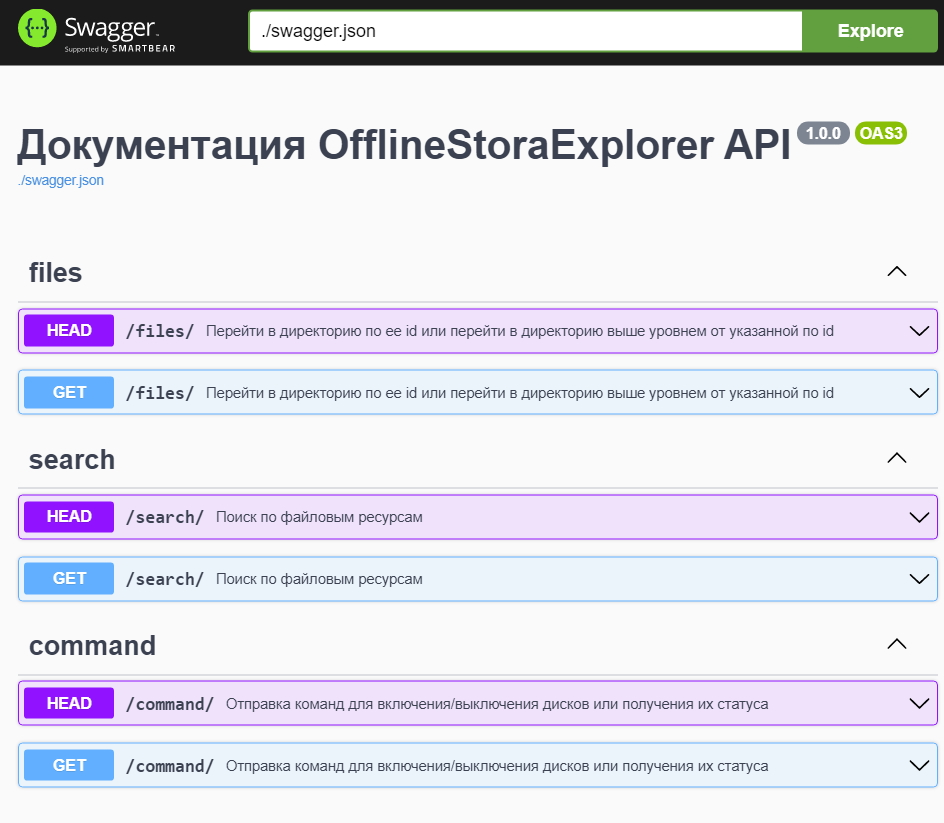

# OfflineStoraExplorer 1.0

Backend на python для сервиса по оффлайновому просмотру файловых систем отмонтированных сетевых хранилищ. 
DB: MongoDB

Реализованы:
- API для SPA-frontend с использованием aiohttp
- модуль взаимодействия с MongoDB с использованием motor_asyncio
- консольная утилита ofe_cli для создания, удаления сетевых ресурсов и обновления данных по ним в базе данных
- документация к API в Swagger

